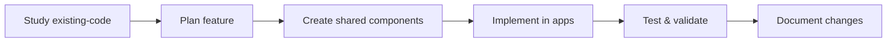

# Getting Started

Welcome to the Academy Mobile Apps development! This guide will help you set up your development environment and start building features for both the instructor and student applications.

## 🎯 Prerequisites

Before starting development, ensure you have:
- **Node.js**: 18.0.0 or higher
- **npm**: 9.0.0 or higher  
- **Expo CLI**: Latest version (`npm install -g @expo/cli`)
- **Git**: Latest version
- **Code Editor**: VS Code recommended with React Native extensions

### Platform-Specific Requirements

#### iOS Development
- **macOS**: Required for iOS development
- **Xcode**: Latest version from App Store
- **iOS Simulator**: Installed with Xcode
- **CocoaPods**: `sudo gem install cocoapods`

#### Android Development
- **Android Studio**: Latest version
- **Android SDK**: API level 33+ (Android 13+)
- **Android Emulator**: Configured and running
- **Java Development Kit**: JDK 11 or higher

## 🚀 Quick Setup

### 1. Clone the Repository

```bash
git clone <repository-url>
cd academy-apps
```

### 2. Install Dependencies

The project uses npm workspaces for dependency management:

```bash
# Install all dependencies for the entire monorepo
npm install

# Dependencies are automatically installed for:
# - Root workspace
# - students-app/
# - instructors-app/
# - shared/
```

### 3. Start Development

Start individual apps (recommended approach):

```bash
# Instructor app
npm run start:instructors
# or
cd instructors-app && npx expo start --offline

# Student app  
npm run start:students
# or
cd students-app && npx expo start --offline
```

### 4. Open on Device/Simulator

- **Expo Go**: Scan QR code with Expo Go app
- **Development Build**: Use custom development client
- **Simulator**: Press `i` for iOS, `a` for Android

## 🏗️ Project Structure

```
academy-apps/
├── instructors-app/               # Instructor mobile app
│   ├── src/
│   │   ├── features/             # Feature-based modules
│   │   │   ├── auth/             # Authentication screens
│   │   │   ├── attendance/       # Attendance tracking
│   │   │   ├── classroom/        # Classroom management
│   │   │   ├── home/             # Dashboard
│   │   │   ├── performance/      # Performance analytics
│   │   │   ├── scheduling/       # Schedule management
│   │   │   └── students/         # Student management
│   │   ├── navigation/           # App navigation
│   │   ├── services/             # API services
│   │   └── types/                # TypeScript types
│   ├── assets/                   # App-specific assets
│   ├── existing-code/            # Reference implementation
│   └── package.json
│
├── students-app/                 # Student mobile app
│   ├── src/
│   │   ├── features/             # Feature-based modules
│   │   │   ├── auth/             # Authentication screens
│   │   │   ├── bookings/         # Course booking
│   │   │   ├── courses/          # Course catalog
│   │   │   ├── home/             # Student dashboard
│   │   │   ├── profile/          # Profile management
│   │   │   └── progress/         # Progress tracking
│   │   ├── navigation/           # App navigation
│   │   ├── services/             # API services
│   │   └── types/                # TypeScript types
│   ├── assets/                   # App-specific assets
│   ├── existing-code/            # Reference implementation
│   └── package.json
│
├── shared/                       # Shared components & services
│   ├── src/
│   │   ├── components/          # Reusable UI components
│   │   │   ├── auth/            # Auth components
│   │   │   ├── charts/          # Chart components
│   │   │   ├── forms/           # Form components
│   │   │   ├── program/         # Program context components
│   │   │   └── ui/              # UI components
│   │   ├── hooks/               # Shared React hooks
│   │   ├── services/            # API client & services
│   │   ├── store/               # Zustand stores
│   │   ├── theme/               # Academy theme system
│   │   ├── types/               # Shared TypeScript types
│   │   └── utils/               # Utility functions
│   └── package.json
│
├── docs/                         # Documentation
└── package.json                 # Root package configuration
```

## 🛠️ Development Workflow

### 1. Feature Development Process



### 2. Code Quality Checks

Before committing, run these commands from the root directory:

```bash
# Test both apps
npm run test

# Or test individually
npm run test:students
npm run test:instructors

# Run tests with coverage
npm run test:coverage

# Test in watch mode (for development)
npm run test:watch
```

### 3. Git Workflow

```bash
# Create feature branch
git checkout -b feature/student-enrollment

# Make changes and commit
git add .
git commit -m "feat: add student enrollment form"

# Push and create PR
git push origin feature/student-enrollment
```

## 🔧 Environment Configuration

### Environment Files

Create environment files in the root directory:

```bash
# .env.development
EXPO_PUBLIC_API_URL=http://localhost:8000/api/v1
EXPO_PUBLIC_ENV=development
EXPO_PUBLIC_DEBUG_MODE=true

# .env.staging  
EXPO_PUBLIC_API_URL=https://staging-api.academy.com/api/v1
EXPO_PUBLIC_ENV=staging
EXPO_PUBLIC_DEBUG_MODE=false

# .env.production
EXPO_PUBLIC_API_URL=https://api.academy.com/api/v1
EXPO_PUBLIC_ENV=production
EXPO_PUBLIC_DEBUG_MODE=false
```

### Backend Setup

The apps connect to the Academy backend. Ensure it's running:

```bash
# From academy-admin directory
cd ../academy-admin
docker-compose up db backend
```

Backend should be available at: `http://localhost:8000`

## 📱 Development Tools

### Essential VS Code Extensions

Install these extensions for the best development experience:

```json
{
  "recommendations": [
    "ms-vscode.vscode-typescript-next",
    "esbenp.prettier-vscode",
    "ms-vscode.vscode-eslint",
    "expo.vscode-expo-tools",
    "ms-vscode.vscode-react-native"
  ]
}
```

### Debugging Setup

#### React Native Debugger

```bash
# Install React Native Debugger
brew install --cask react-native-debugger

# Start debugger
open "rndebugger://set-debugger-loc?host=localhost&port=19000"
```

#### VS Code Debugging

Create `.vscode/launch.json`:

```json
{
  "version": "0.2.0",
  "configurations": [
    {
      "name": "Debug Instructor App",
      "type": "node",
      "request": "launch",
      "program": "${workspaceFolder}/node_modules/@expo/cli/bin/cli",
      "args": ["start"],
      "cwd": "${workspaceFolder}/instructors-app",
      "console": "integratedTerminal",
      "internalConsoleOptions": "neverOpen"
    },
    {
      "name": "Debug Student App",
      "type": "node",
      "request": "launch",
      "program": "${workspaceFolder}/node_modules/@expo/cli/bin/cli",
      "args": ["start"],
      "cwd": "${workspaceFolder}/students-app",
      "console": "integratedTerminal",
      "internalConsoleOptions": "neverOpen"
    }
  ]
}
```

## 🧪 Testing Setup

### Running Tests

```bash
# Run all tests
npm run test

# Run tests with coverage
npm run test:coverage

# Run tests in watch mode
npm run test:watch

# Test specific app
npm run test:students
npm run test:instructors
```

### Test Structure

```bash
src/
├── features/
│   ├── auth/
│   │   ├── screens/
│   │   │   ├── LoginScreen.tsx
│   │   │   └── __tests__/
│   │   │       └── LoginScreen.test.tsx
│   │   └── hooks/
│   │       ├── useAuthForm.ts
│   │       └── __tests__/
│   │           └── useAuthForm.test.ts
└── components/
    ├── ErrorBoundary.tsx
    └── __tests__/
        └── ErrorBoundary.test.tsx
```

## 📊 Common Development Tasks

### 1. Adding a New Shared Component

```bash
# Create component file
touch shared/src/components/ui/NewComponent.tsx

# Add to exports in shared/src/components/ui/index.ts
echo "export { default as NewComponent } from './NewComponent';" >> shared/src/components/ui/index.ts

# Use in apps
import { NewComponent } from '@academy/mobile-shared';
```

### 2. Adding New API Endpoints

```typescript
// In shared/src/services/apiClient.ts
export const studentApi = {
  getAll: () => apiClient.get<Student[]>('/students'),
  getById: (id: string) => apiClient.get<Student>(`/students/${id}`),
  create: (data: CreateStudentData) => apiClient.post<Student>('/students', data),
  update: (id: string, data: UpdateStudentData) => 
    apiClient.put<Student>(`/students/${id}`, data),
  delete: (id: string) => apiClient.delete(`/students/${id}`)
};
```

### 3. Creating New Screens

```typescript
// instructors-app/src/features/students/screens/StudentListScreen.tsx
import React from 'react';
import { View, Text, FlatList } from 'react-native';
import { 
  useAuthStore, 
  CustomInput, 
  Header, 
  StudentCard,
  ProgramGuard 
} from '@academy/mobile-shared';

export default function StudentListScreen() {
  const { user, hasRole } = useAuthStore();
  
  return (
    <ProgramGuard minimumRoleLevel="tutor">
      <View>
        <Header 
          title="Students" 
          variant="instructor"
          onSearchPress={handleSearch}
        />
        {/* Screen content */}
      </View>
    </ProgramGuard>
  );
}
```

### 4. Adding Navigation

```typescript
// instructors-app/src/navigation/StudentsNavigator.tsx
import { createNativeStackNavigator } from '@react-navigation/native-stack';
import StudentListScreen from '../features/students/screens/StudentListScreen';
import StudentDetailScreen from '../features/students/screens/StudentDetailScreen';

const Stack = createNativeStackNavigator();

export default function StudentsNavigator() {
  return (
    <Stack.Navigator>
      <Stack.Screen name="StudentList" component={StudentListScreen} />
      <Stack.Screen name="StudentDetail" component={StudentDetailScreen} />
    </Stack.Navigator>
  );
}
```

## 🔄 Working with Existing Code

The `existing-code/` directories contain working implementations that serve as references:

### Study Before Building

```bash
# Examine existing implementations
ls instructors-app/existing-code/src/
ls students-app/existing-code/src/

# Study component patterns
cat instructors-app/existing-code/src/components/form/customInput.tsx
```

### Migration Strategy

1. **Analyze**: Study the existing implementation
2. **Plan**: Design the modern equivalent with Academy theming
3. **Build**: Create with latest dependencies and patterns
4. **Test**: Ensure feature parity
5. **Document**: Update docs with new patterns

## 🐛 Troubleshooting

### Common Issues

#### Metro Bundler Issues

```bash
# Clear Metro cache
npx expo start --clear

# From specific app directory
cd instructors-app
npx expo start --clear
```

#### Dependency Issues

```bash
# Clean install
rm -rf node_modules package-lock.json
npm install

# Clean specific app
cd instructors-app
rm -rf node_modules
cd ../
npm install
```

#### iOS Build Issues

```bash
# Clean iOS build
cd instructors-app
npx expo run:ios --clear

# Update CocoaPods (if using development build)
cd ios && pod install && cd ..
```

#### Android Build Issues

```bash
# Clean Android build
cd instructors-app
npx expo run:android --clear

# Clean Gradle cache (if using development build)
cd android && ./gradlew clean && cd ..
```

### WSL Issues

If using Windows Subsystem for Linux:

```bash
# Move project to WSL filesystem for better performance
cp -r /mnt/c/Users/username/academy-apps ~/academy-apps
cd ~/academy-apps
```

### Module Resolution Issues

```bash
# Verify workspace links are correct
npm ls @academy/mobile-shared

# Recreate workspace symlinks
npm install

# Check that shared package is accessible
cd instructors-app
node -e "console.log(require.resolve('@academy/mobile-shared'))"
```

## 📚 Next Steps

After setup, explore these areas:

1. **[Academy Theme System](../THEME_SYSTEM.md)** - Academy branding and theming
2. **[Authentication System](../authentication/README.md)** - User management and security
3. **[Form Components](../components/forms/README.md)** - Building user interfaces
4. **[Multi-Program Context](../architecture/MULTI_PROGRAM_CONTEXT.md)** - Program switching
5. **[API Client](../api/API_CLIENT.md)** - Backend integration

## 🤝 Getting Help

- **Documentation**: Check the `/docs` directory
- **Existing Code**: Study implementations in `existing-code/`
- **Issues**: Create GitHub issues for bugs
- **Discussions**: Use GitHub discussions for questions

## 📋 Development Checklist

Before starting feature development:

- [ ] Environment set up and running
- [ ] Both apps start successfully (`npm run start:instructors` and `npm run start:students`)
- [ ] Backend API is accessible at `http://localhost:8000`
- [ ] Tests are passing (`npm run test`)
- [ ] Can import from shared package (`@academy/mobile-shared`)
- [ ] Academy theme system is working
- [ ] Documentation is accessible

## 🎯 Key Academy Features to Understand

- **Academy Theming**: Purple (#4F2EC9) brand color with light/dark/night modes
- **Multi-Program Support**: Handle multiple academy programs with context switching
- **Component Library**: 45+ Academy-themed components in `@academy/mobile-shared`
- **Feature-Based Architecture**: Organize code by features, not file types
- **Type Safety**: Full TypeScript support with zero compilation errors

You're now ready to start building amazing features for the Academy Mobile Apps! 🚀