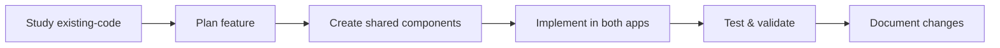

# Getting Started

Welcome to the Academy Mobile Apps development! This guide will help you set up your development environment and start building features for both the instructor and student applications.

## 🎯 Prerequisites

Before starting development, ensure you have:
- **Node.js**: 18.0.0 or higher
- **npm**: 9.0.0 or higher  
- **Expo CLI**: Latest version (`npm install -g @expo/cli`)
- **Git**: Latest version
- **Code Editor**: VS Code recommended with React Native extensions

### Platform-Specific Requirements

#### iOS Development
- **macOS**: Required for iOS development
- **Xcode**: Latest version from App Store
- **iOS Simulator**: Installed with Xcode
- **CocoaPods**: `sudo gem install cocoapods`

#### Android Development
- **Android Studio**: Latest version
- **Android SDK**: API level 33+ (Android 13+)
- **Android Emulator**: Configured and running
- **Java Development Kit**: JDK 11 or higher

## 🚀 Quick Setup

### 1. Clone the Repository

```bash
git clone <repository-url>
cd academy-apps
```

### 2. Install Dependencies

The project uses npm workspaces for dependency management:

```bash
# Install all dependencies for the entire monorepo
npm run install:all

# Or install individually
npm install              # Root dependencies
npm run install:shared   # Shared package
npm run install:instructor # Instructor app
npm run install:student  # Student app
```

### 3. Start Development

Start both apps simultaneously:

```bash
npm run dev:all
```

Or start individual apps:

```bash
# Instructor app (port 19006)
npm run dev:instructor

# Student app (port 19007) 
npm run dev:student
```

### 4. Open on Device/Simulator

- **Expo Go**: Scan QR code with Expo Go app
- **Development Build**: Use custom development client
- **Simulator**: Press `i` for iOS, `a` for Android

## 🏗️ Project Structure

```
academy-apps/
├── academy-instructors-app/    # Instructor mobile app
│   ├── src/
│   │   ├── features/          # Feature-based modules
│   │   ├── core/              # Core app functionality
│   │   ├── services/          # API services
│   │   └── types/             # TypeScript types
│   ├── assets/                # App-specific assets
│   ├── existing-code/         # Reference implementation
│   └── package.json
│
├── academy-students-app/       # Student mobile app
│   ├── src/
│   │   ├── features/          # Feature-based modules
│   │   ├── core/              # Core app functionality
│   │   ├── services/          # API services
│   │   └── types/             # TypeScript types
│   ├── assets/                # App-specific assets
│   ├── existing-code/         # Reference implementation
│   └── package.json
│
├── shared/                     # Shared components & services
│   ├── src/
│   │   ├── components/        # Reusable UI components
│   │   ├── store/             # Zustand stores
│   │   ├── services/          # API client & services
│   │   ├── types/             # Shared TypeScript types
│   │   └── utils/             # Utility functions
│   └── package.json
│
├── docs/                       # Documentation
├── docker-compose.yml          # Docker development setup
└── package.json               # Root package configuration
```

## 🛠️ Development Workflow

### 1. Feature Development Process



### 2. Code Quality Checks

Before committing, run:

```bash
# Type check all packages
npm run type-check:all

# Lint all packages
npm run lint:all

# Run tests
npm run test:all

# Format code
npm run format
```

### 3. Git Workflow

```bash
# Create feature branch
git checkout -b feature/student-enrollment

# Make changes and commit
git add .
git commit -m "feat: add student enrollment form"

# Push and create PR
git push origin feature/student-enrollment
```

## 🔧 Environment Configuration

### Environment Files

Create environment files in the root directory:

```bash
# .env.development
EXPO_PUBLIC_API_URL=http://localhost:8000/api/v1
EXPO_PUBLIC_ENV=development
EXPO_PUBLIC_DEBUG_MODE=true

# .env.staging  
EXPO_PUBLIC_API_URL=https://staging-api.academy.com/api/v1
EXPO_PUBLIC_ENV=staging
EXPO_PUBLIC_DEBUG_MODE=false

# .env.production
EXPO_PUBLIC_API_URL=https://api.academy.com/api/v1
EXPO_PUBLIC_ENV=production
EXPO_PUBLIC_DEBUG_MODE=false
```

### Backend Setup

The apps connect to the Academy backend. Ensure it's running:

```bash
# From academy-admin directory
cd ../academy-admin
docker-compose up db backend
```

Backend should be available at: `http://localhost:8000`

## 📱 Development Tools

### Essential VS Code Extensions

```json
{
  "recommendations": [
    "ms-vscode.vscode-typescript-next",
    "bradlc.vscode-tailwindcss",
    "esbenp.prettier-vscode",
    "ms-vscode.vscode-eslint",
    "expo.vscode-expo-tools",
    "ms-vscode.vscode-react-native"
  ]
}
```

### Debugging Setup

#### React Native Debugger

```bash
# Install React Native Debugger
brew install --cask react-native-debugger

# Start debugger
open "rndebugger://set-debugger-loc?host=localhost&port=19000"
```

#### VS Code Debugging

Create `.vscode/launch.json`:

```json
{
  "version": "0.2.0",
  "configurations": [
    {
      "name": "Debug Expo",
      "type": "node",
      "request": "launch",
      "program": "${workspaceFolder}/node_modules/@expo/cli/bin/cli",
      "args": ["start"],
      "console": "integratedTerminal",
      "internalConsoleOptions": "neverOpen"
    }
  ]
}
```

## 🧪 Testing Setup

### Running Tests

```bash
# Run all tests
npm run test:all

# Run tests with coverage
npm run test:all -- --coverage

# Run tests in watch mode
npm run test:all -- --watch

# Run specific test file
npm test -- --testPathPattern="CustomInput"
```

### Test Structure

```bash
src/
├── components/
│   ├── CustomInput.tsx
│   └── __tests__/
│       └── CustomInput.test.tsx
├── services/
│   ├── apiClient.ts
│   └── __tests__/
│       └── apiClient.test.ts
└── utils/
    └── __tests__/
        └── validators.test.ts
```

## 📊 Common Development Tasks

### 1. Adding a New Shared Component

```bash
# Create component file
touch shared/src/components/forms/NewComponent.tsx

# Add to exports
echo "export { default as NewComponent } from './NewComponent';" >> shared/src/components/forms/index.ts

# Use in apps
import { NewComponent } from '@shared';
```

### 2. Adding New API Endpoints

```typescript
// In shared/src/services/apiClient.ts
export const studentApi = {
  getAll: () => apiClient.get<Student[]>('/students'),
  getById: (id: string) => apiClient.get<Student>(`/students/${id}`),
  create: (data: CreateStudentData) => apiClient.post<Student>('/students', data),
  update: (id: string, data: UpdateStudentData) => 
    apiClient.put<Student>(`/students/${id}`, data),
  delete: (id: string) => apiClient.delete(`/students/${id}`)
};
```

### 3. Creating New Screens

```typescript
// src/features/students/screens/StudentListScreen.tsx
import React from 'react';
import { View, Text, FlatList } from 'react-native';
import { useAuthStore, CustomInput, useNotifications } from '@shared';

export default function StudentListScreen() {
  const { user, hasRole } = useAuthStore();
  const { showError } = useNotifications();
  
  // Implementation
  return (
    <View>
      <Text>Student List</Text>
      {/* Screen content */}
    </View>
  );
}
```

### 4. Adding Navigation

```typescript
// src/navigation/StudentsNavigator.tsx
import { createNativeStackNavigator } from '@react-navigation/native-stack';
import StudentListScreen from '../features/students/screens/StudentListScreen';
import StudentDetailScreen from '../features/students/screens/StudentDetailScreen';

const Stack = createNativeStackNavigator();

export default function StudentsNavigator() {
  return (
    <Stack.Navigator>
      <Stack.Screen name="StudentList" component={StudentListScreen} />
      <Stack.Screen name="StudentDetail" component={StudentDetailScreen} />
    </Stack.Navigator>
  );
}
```

## 🔄 Working with Existing Code

The `existing-code/` directories contain working implementations that serve as references:

### Study Before Building

```bash
# Examine existing implementations
ls academy-instructors-app/existing-code/src/
ls academy-students-app/existing-code/src/

# Study component patterns
cat academy-instructors-app/existing-code/src/components/form/customInput.tsx
```

### Migration Strategy

1. **Analyze**: Study the existing implementation
2. **Plan**: Design the modern equivalent
3. **Build**: Create with latest dependencies and patterns
4. **Test**: Ensure feature parity
5. **Document**: Update docs with new patterns

## 🐛 Troubleshooting

### Common Issues

#### Metro Bundler Issues

```bash
# Clear Metro cache
npm start -- --clear

# Reset everything
npm run dev:fresh
```

#### Dependency Issues

```bash
# Clean install
npm run clean:all
npm run install:all

# Nuclear option - complete reset
npm run reset
```

#### iOS Build Issues

```bash
# Clean iOS build
cd academy-instructors-app
npx expo run:ios --clear

# Update CocoaPods
cd ios && pod install && cd ..
```

#### Android Build Issues

```bash
# Clean Android build
cd academy-instructors-app
npx expo run:android --clear

# Clean Gradle cache
cd android && ./gradlew clean && cd ..
```

### WSL Issues

If using Windows Subsystem for Linux:

```bash
# Move project to WSL filesystem for better performance
cp -r /mnt/c/Users/username/academy-apps ~/academy-apps
cd ~/academy-apps
```

## 📚 Next Steps

After setup, explore these areas:

1. **[Authentication System](../authentication/README.md)** - User management and security
2. **[Form Components](../components/forms/README.md)** - Building user interfaces
3. **[API Client](../api/API_CLIENT.md)** - Backend integration
4. **[System Overview](../architecture/SYSTEM_OVERVIEW.md)** - Understanding the architecture

## 🤝 Getting Help

- **Documentation**: Check the `/docs` directory
- **Existing Code**: Study implementations in `existing-code/`
- **Issues**: Create GitHub issues for bugs
- **Discussions**: Use GitHub discussions for questions

## 📋 Development Checklist

Before starting feature development:

- [ ] Environment set up and running
- [ ] Both apps start successfully
- [ ] Backend API is accessible
- [ ] Code quality tools are working
- [ ] Tests are passing
- [ ] Documentation is accessible

You're now ready to start building amazing features for the Academy Mobile Apps! 🚀